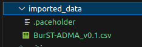
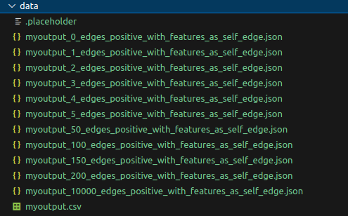
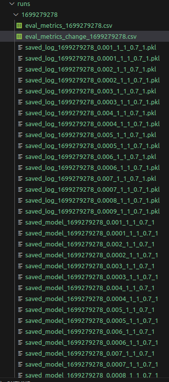

# EvolveGCNOi_CPM

This is the implementation of `EvolveGCNOi_CPM` model defined in
`State of the Art and First Synthetic Dataset for Misbehavior Detection with Collective Perception in [C-]V2X Networks`
paper.

Please kindly cite the paper as

```bibtext
@inproceedings{yuce2025state,
  title={State of the Art and First Synthetic Dataset for Misbehavior Detection with Collective Perception in [C-]V2X Networks},
  author={Yuce, Mehmet Fatih and Erturk, Mehmet Ali and Aydin, Muhammed Ali},
  booktitle={2025 IEEE 36th Annual International Symposium on Personal, Indoor and Mobile Radio Communications (PIMRC)},
  year={2025},
  organization={IEEE} 
}
```

# Steps

The model generation consists of three stages.

- Adding clustering information to BURST-Adma dataset's each timestep.
- Generating Graph Neural Networks (GNNs) dataset
- Hyperparameters search
- Model tries

# Setup

Get cuda version

```bash
nvcc --version

nvcc: NVIDIA (R) Cuda compiler driver
Copyright (c) 2005-2022 NVIDIA Corporation
Built on Wed_Jun__8_16:49:14_PDT_2022
Cuda compilation tools, release 11.7, V11.7.99
Build cuda_11.7.r11.7/compiler.31442593_0
```

## Installing `conda`

From: https://docs.anaconda.com/miniconda/

```bash
mkdir -p ~/miniconda3
wget https://repo.anaconda.com/miniconda/Miniconda3-latest-Linux-x86_64.sh -O ~/miniconda3/miniconda.sh
bash ~/miniconda3/miniconda.sh -b -u -p ~/miniconda3
rm ~/miniconda3/miniconda.sh
```

Do not forget to update .bashrc

## From Yaml

```bash
conda env create --name egcnoi_env --file=export.yaml
conda activate egcnoi_env
```

## From Command Line (Not properly tested!)

```bash
conda create --name egcnoi python=3.10.9 ipython
conda activate egcnoi

# conda install pytorch torchvision torchaudio pytorch-cuda=11.7 -c pytorch -c nvidia
conda install pytorch==1.13.1 torchvision==0.14.1 torchaudio==0.13.1 pytorch-cuda=11.7 -c pytorch -c nvidia

# conda install pyg -c pyg
pip install torch-scatter torch-sparse torch-cluster torch-spline-conv torch-geometric -f https://data.pyg.org/whl/torch-1.13.1+cu117.html

pip install torch-geometric-temporal

conda install -c anaconda pandas
conda install -c anaconda numpy

conda install -c conda-forge matplotlib
conda install -c anaconda seaborn
conda install -c conda-forge scikit-learn
conda install -c conda-forge tqdm
conda install -c anaconda ipywidgets

pip install hiddenlayer
pip install torchviz
conda install -c conda-forge ipympl
```

## Adding Clustering Information to BURST-Adma Dataset's each Timestep.

[add_clustering_information.ipynb](./add_clustering_information.ipynb)



# Generating Graph Neural Networks (GNNs) dataset

[generate_gnn_datasets.ipynb](./generate_gnn_datasets.ipynb)



# Hyperparameters search

[hyper_parameter_search.ipynb](./hyper_parameter_search.ipynb)



# Model Tries

`model_tries.py` and `model_tries.ipynb` contains manual tests that can be
conducted for experiemntations.
